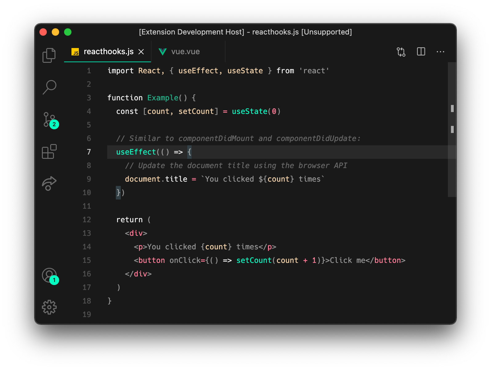

# ☕️ After Eight

A Visual Studio Code theme inspired by the After Eight & Mint colours.

## Preview

# Installation

1.  Install [Visual Studio Code](https://code.visualstudio.com/)
2.  Launch Visual Studio Code
3.  Choose **Extensions** from menu
4.  Search for `After eight`
5.  Click **Install** to install it
6.  Click **Reload** to reload the Code
7.  From the menu bar click: Code > Preferences > Color Theme > **After Eight**
